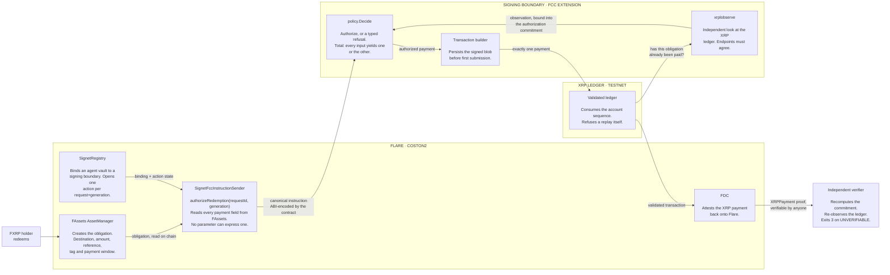
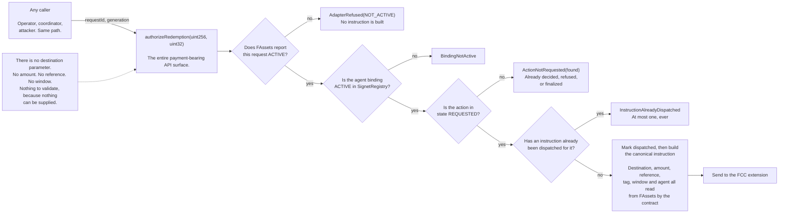
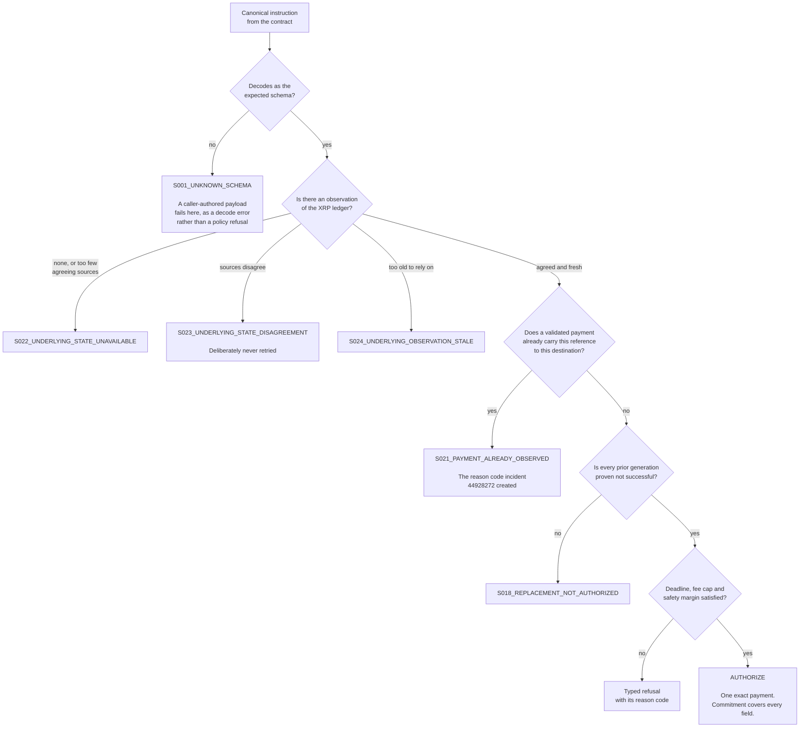
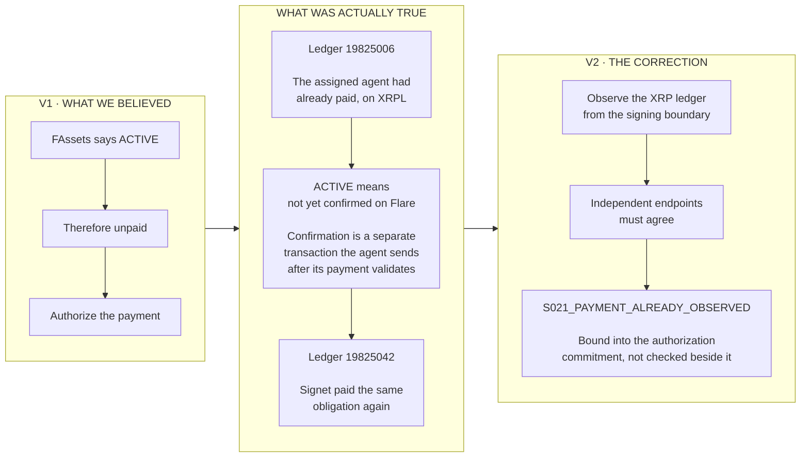
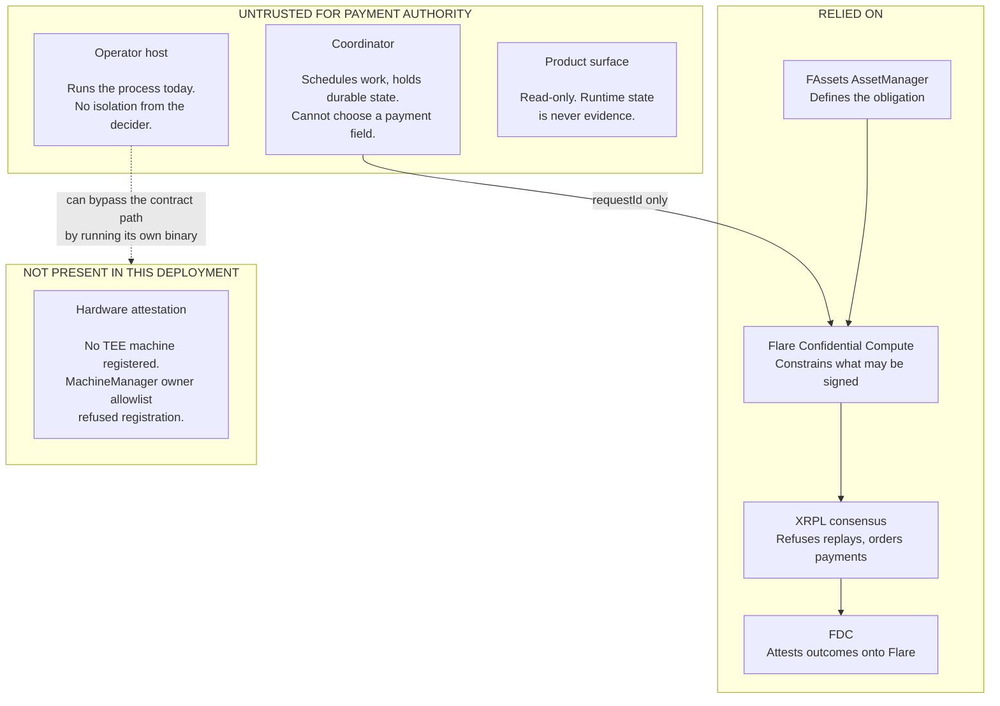

# Signet architecture

**FAssets decides what is owed. Signet decides whether that exact XRP payment may exist. FDC proves
what happened.**

Signet sits between a FAssets redemption obligation on Flare and the XRP payment that discharges it
on the XRP ledger. The design goal is narrow and structural: **an operator, a coordinator, or anyone
else with access to the request path must not be able to choose what gets paid.**

---

## 1. The whole flow



Take any one of the four away and something specific breaks:

| remove | what breaks |
|---|---|
| **FAssets** | there is no authoritative obligation, and Signet degrades into enforcing a policy someone typed |
| **FCC** | a compromised host signs arbitrary XRP |
| **XRPL observation** | a payment already made by another party is invisible. This is [incident 44928272](docs/evidence/incident-44928272.md), not a hypothesis |
| **FDC** | completion cannot be established on Flare, and the operator's word becomes the evidence |

---

## 2. What a caller can and cannot express

This is the core security property, and it is structural rather than statistical: the fields simply
do not exist as parameters.



The dispatch marker is written **before** the external call, so a reentrant caller cannot get
underneath it, and it lives on chain rather than in the extension because a restart gives the
extension a new identity and would lose it.

---

## 3. The decision, and every way it refuses

`Decide` is total: every input produces an authorization or a typed refusal, never a crash and never
silence. That totality is what makes the boundary trustworthy, and it is fuzzed rather than asserted.



Refusing is the default. There is no input that authorizes without an observation.

---

## 4. Incident 44928272, and why V2 exists

The first model asked Flare whether an obligation was outstanding. Flare answered honestly, and the
answer was not the question that mattered.



All three of Signet's duplicate-payment guards were real and all three watched Flare. The registry
action state, the coordinator's unique indexes and the ledger's sequence consumption each prevent
*Signet* paying twice. None can see a payment made by somebody else. **The defect was not a missing
check. It was a missing chain.**

Residual, stated rather than hidden: `S021` fires on a payment that has *validated*. Between another
party submitting and that payment validating, Signet can still observe nothing. That window cannot
be closed by observation, only by exclusive signing authority over the underlying account, which is
production architecture and is not instantiated here.

---

## 5. Trust boundaries



The host is the honest weak point. Gate B removes the **protocol-level** path to an arbitrary
signature; it does not create isolation between the decider and the machine it runs on. That is what
a real TEE would buy, and this deployment does not have one. Recorded as a medium residual in
[the threat model](docs/threat-model.md), and every claim that touches it says so.

---

## 6. Components

| component | language | role |
|---|---|---|
| [`contracts/src/fcc/SignetFccInstructionSender.sol`](contracts/src/fcc/SignetFccInstructionSender.sol) | Solidity | the only payment-bearing entry point; derives the canonical instruction from FAssets |
| [`contracts/src/adapters/FAssetsAdapter.sol`](contracts/src/adapters/FAssetsAdapter.sol) | Solidity | reads the obligation, refuses anything not `ACTIVE` |
| [`contracts/src/SignetRegistry.sol`](contracts/src/SignetRegistry.sol) | Solidity | agent bindings, action lifecycle, approved code hashes and signers |
| [`extension/internal/policy/`](extension/internal/policy/) | Go | the decision, its reason codes, and its totality |
| [`extension/internal/xrplobserve/`](extension/internal/xrplobserve/) | Go | independent XRP ledger observation across endpoints that must agree |
| [`extension/internal/fccinput/`](extension/internal/fccinput/) | Go | decodes the contract-built instruction; a caller-authored payload fails to decode |
| [`reference/src/`](reference/src/) | TypeScript | executable reference model and frozen fixtures the Go side must match |
| [`verifier/src/`](verifier/src/) | TypeScript | re-checks a receipt from a fresh clone with no credentials |
| [`coordinator/`](coordinator/) | SQL, JS | durable state, untrusted for payment authority |
| [`web/`](web/) | JS | the product surface, generated from the evidence in this repository |

---

## 7. What is deployed

| | |
|---|---|
| Network | Flare Coston2, chain id 114 |
| `SignetRegistry` | [`0x381bdE5961695914B28B16f405d51E8acB877f6e`](https://coston2.testnet.flarescan.com/address/0x381bdE5961695914B28B16f405d51E8acB877f6e) |
| `SignetFccInstructionSender` | [`0x7e2dd9078c7d741e0cF81904264A79e70212963a`](https://coston2.testnet.flarescan.com/address/0x7e2dd9078c7d741e0cF81904264A79e70212963a) |
| FCC extension | `66248`, registered on the live `FlareTeeManager` |
| FCC machine | **not registered.** Registration reverted `OwnerNotAllowed` |
| Execution | **simulated.** A local process, not a Confidential Space VM |
| Hardware attestation | **none, and not claimed anywhere** |

Addresses are read from [`deployments/coston2.json`](deployments/coston2.json), which is the source
of truth. Superseded extensions `66163`, `66164` and `66244` are recorded there with their reasons.

---

## 8. Reproducing it

```bash
git clone https://github.com/winsznx/signet
cd signet
pnpm install --frozen-lockfile
bash scripts/install-go.sh

make verify     # every gate: contracts, Go, reference model, conformance, secrets, evidence
make judge      # independent verification: no wallet, no funds, no Docker, no GCP, no secrets
make doctor     # read-only diagnosis of the deployed FCC surface
```

`make judge` currently returns **13 PASS, 0 FAIL, 2 UNVERIFIABLE**. `UNVERIFIABLE` is never folded
into a pass: it means the check could not be performed from where it ran, and both instances are
explained on [the proof page](https://signet-proof.pages.dev/proof).

Further reading: [threat model](docs/threat-model.md) &middot;
[guarantee](docs/guarantee.md) &middot;
[incident 44928272](docs/evidence/incident-44928272.md) &middot;
[claim ledger](evidence/claim-ledger.json) &middot;
[open-source surface](docs/submission/open-source-surface.md)
