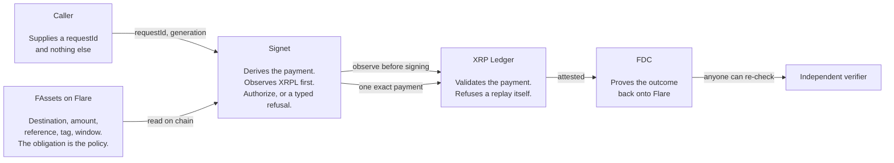
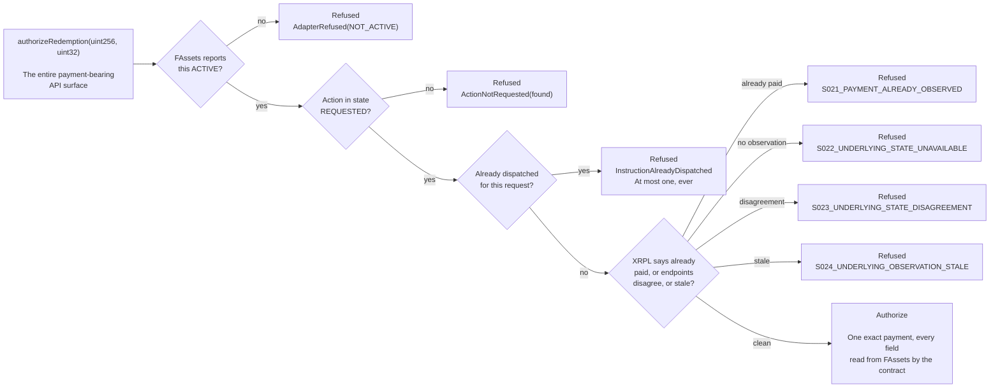

# Signet

An attested external execution layer for FAssets agents.

A FAssets agent has to make an exact XRP payment against a redemption obligation. Today the thing
that decides what to pay and the thing that holds the key are the same process, so an operator
mistake or a compromised coordinator is a wrong payment. Signet is the thing in between.



---

## Boundary, before anything else

### Real

| | |
|---|---|
| Coston2 FAssets obligation | request `44928272`, created through the ordinary minter path |
| Coston2 contracts | [`SignetRegistry`](https://coston2.testnet.flarescan.com/address/0x381bdE5961695914B28B16f405d51E8acB877f6e), [`SignetInstructionSender`](https://coston2.testnet.flarescan.com/address/0xd6cF30B6411DB8465147FfDcF0e0418030B4b9CA) |
| FCC extension registration | extension `66248`, sender [`0x7e2dd907…963a`](https://coston2.testnet.flarescan.com/address/0x7e2dd9078c7d741e0cF81904264A79e70212963a), on the live `FlareTeeManager` |
| XRPL Testnet payment | signed, persisted before submission, validated, reconciled across independent endpoints |
| Coston2 FDC verification | `verifyXRPPayment` accepted on chain |

### Simulated

| | |
|---|---|
| the FCC execution environment | the extension runs as a local process, not in a Confidential Space VM |

### Not claimed

Hardware TEE attestation. Whitelisted-agent operation. Own-agent FAssets settlement. Universal
exactly-once payment.

---

## What a caller can and cannot express



There is no destination parameter. No amount, no reference, no window. Nothing to validate, because
nothing can be supplied. Full detail in [ARCHITECTURE.md](ARCHITECTURE.md).

---

## Judge path

```bash
pnpm install --frozen-lockfile
bash scripts/install-go.sh
make verify
```

That is the whole setup, and it runs from a clean clone.

Then check a claim yourself, which is the part that matters:

```bash
pnpm --filter @signet/verifier verify:receipt <transaction hash from evidence/receipts/>
```

`UNVERIFIABLE` exits 3. It is not a pass, and it is used deliberately.

Then verify the deployment without trusting this repository at all:

```bash
cast call 0x1a9C4A0f9D76c0b1D91d22E24E573a9b377618aE \
  "getTeeExtensionInstructionsSender(uint256)(address)" 66248 \
  --rpc-url https://coston2-api.flare.network/ext/C/rpc
# 0x7e2dd9078c7d741e0cF81904264A79e70212963a
```

The composed lifecycle, which submits a real XRPL Testnet payment and needs a funded testnet account:

```bash
node scripts/lifecycle/run.mjs
```

---

## Where to look

| | |
|---|---|
| **start here** | [`docs/run/FINAL_REVIEW_HANDOFF.md`](docs/run/FINAL_REVIEW_HANDOFF.md) |
| what Flare asked for, and which evidence is live, forked or simulated | [`docs/evidence/organizer-accepted-proof-boundary.md`](docs/evidence/organizer-accepted-proof-boundary.md) |
| what is and is not guaranteed | [`docs/guarantee.md`](docs/guarantee.md) |
| every public claim, with its limitations | [`evidence/claim-ledger.json`](evidence/claim-ledger.json) |
| how the evidence joins up | [`evidence/evidence-graph.json`](evidence/evidence-graph.json) |
| threats closed, and five still open | [`docs/threat-model.md`](docs/threat-model.md) |
| the caller supplies a request id and nothing else | [`docs/evidence/gate-b.md`](docs/evidence/gate-b.md) |
| per-phase evidence | [`docs/evidence/phase-NN.md`](docs/evidence/) |
| recovery procedures | [`docs/runbooks/recovery.md`](docs/runbooks/recovery.md) |
| **architecture, with the full flows drawn** | [`ARCHITECTURE.md`](ARCHITECTURE.md) |
| product requirements | [`PRD.md`](PRD.md) |

Proof page: https://signet-proof.pages.dev/

---

## The most useful thing in here

Signet ran against the live chain and **double-paid a real Coston2 redemption**.

The assigned agent had already paid it. Signet paid it again 36 ledgers later, and Coston2 reported
the request `ACTIVE` the whole time, because `ACTIVE` means "not yet confirmed on Flare" rather than
"unpaid". All three of Signet's duplicate-payment guards watched the wrong chain.

It is corrected at the protocol layer as schema V2, not worked around: the decision now requires the
signing boundary's own XRP ledger observation, taken across independent endpoints that must agree and
bound into the authorization commitment. `scripts/lifecycle/incident-44928272.test.mjs` asserts no
valid input can reproduce the original authorization.

No third party lost funds, which is luck about the test setup rather than a property of the system.

---

## Repository layout

| | |
|---|---|
| `contracts/` | Solidity and Foundry tests |
| `extension/` | Go FCC extension, policy, XRPL observer and transaction construction |
| `reference/` | executable reference model and frozen fixtures |
| `coordinator/` | durable state, untrusted for payment authority |
| `verifier/` | independent claim verifier |
| `web/` | operator and proof pages |
| `upstream/` | eleven pinned official sources, content-hashed in `docs/source-lock.json` |
| `evidence/`, `docs/evidence/` | claims, receipts and per-phase evidence |

No keys or credentials are committed. Deployed addresses in `deployments/coston2.json` are testnet
only.

---

## Licence

[MIT](LICENSE).

The eleven pinned upstream sources under [`upstream/`](upstream/) keep their own licences and are
unmodified; each is content-hashed in [`docs/source-lock.json`](docs/source-lock.json).
